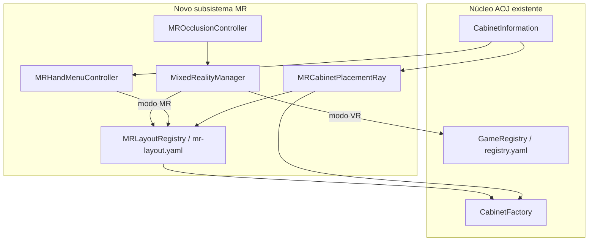
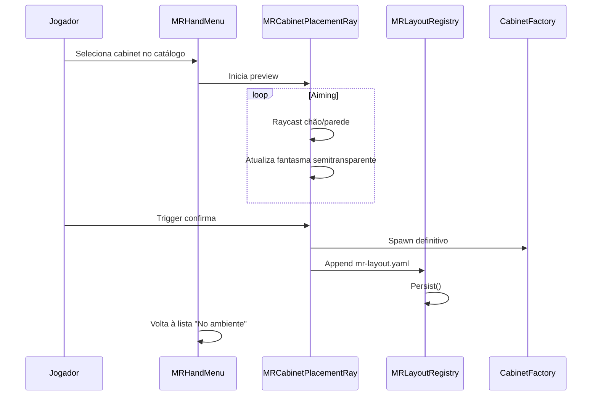
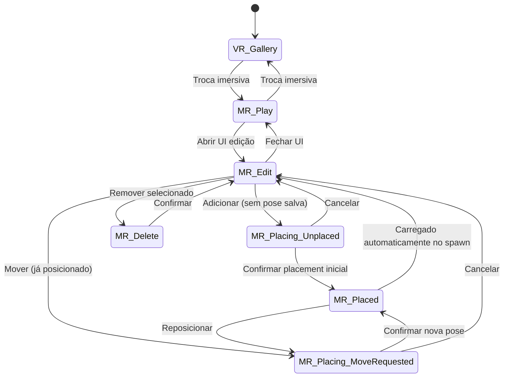

# Age of Joy — Mixed Reality (MR) Mode

## Documentação de design e contribuição

| Campo | Valor |
|-------|-------|
| **Projeto** | [curif/AgeOfJoy-2022.1](https://github.com/curif/AgeOfJoy-2022.1) |
| **Versão de referência** | [0.5.0](https://github.com/curif/AgeOfJoy-2022.1/tree/0.5.0) |
| **Licença** | GPL-3.0 |
| **Status** | MVP fases 1–2c funcional na branch 0.5.0 (validado Quest 3) |
| **Documento** | v1.3 — Maio de 2026 |

---

## 1. Resumo executivo

Esta documentação descreve um **modo Mixed Reality (MR) completo** para o Age of Joy (AOJ): o jogador usa o **ambiente real** (quarto/sala) como fliperama, com máquinas virtuais posicionadas no espaço físico, persistência entre sessões, troca imersiva entre VR clássico e MR, edição de layout na mão, e occlusão por paredes reais.

O modo VR existente (galerias com salas pré-modeladas e slots fixos) **permanece intacto**. O MR é um **subsistema paralelo**, não uma substituição.

---

## 2. Contexto do projeto

### 2.1 O que é o Age of Joy

Simulador de fliperama em VR para Meta Quest, feito em Unity (C#), com máquinas MAME via LibRetro, cabinets customizáveis (GLB + `description.yaml`), e linguagem **AGEBasic** para lógica dos cabinets.

### 2.2 Stack XR relevante

| Componente | Versão / uso |
|------------|----------------|
| `com.meta.xr.sdk.all` | 72.0.0 |
| `com.unity.xr.oculus` | 4.1.2 |
| `com.unity.xr.interaction.toolkit` | 2.5.2 |
| Player | `PlayerController`, `XROrigin`, `ChangeControls` |
| Mãos | `ChangeControls`, `ActionBasedController`, OVR input |

### 2.3 Estado atual em relação ao MR

- Implementação MR funcional em **`Assets/ramiro/`** (passthrough, modos, layout, menu CRT, placement ray).
- Fluxo principal de edição: **`ConfigurationCabinetMiniMR`** (`Resources/ramiro/PrefabsEnvironment/`) com CRT + ficha (`MRConfigurationController`).
- `mr-layout.yaml` **v3** persiste cabinets de jogo (Add/Remove/Move) com pose **relativa ao anchor MRUK** (`anchorUuid` + posição/rotação local); fallback v2 world-space para layouts antigos.
- Pose do config cabinet: **PlayerPrefs** schema 3 (anchor-relative) ou 2 (world legacy), via `MRAnchorPoseResolver` — separado do yaml.
- **First-time placement ray** para config cabinet (sem pose salva) e para Add/Move no catálogo ADDED (floor ray).
- **Add/Move de cabinet de jogo:** CRT volta ao **idle** (`ShowIdle`), ficha ejectada, sai de `MR_EDIT`; placement ray no mundo; jogador re-insere ficha após confirmar pose. **Não** redesenhar menu CABINETS após Add (`HandleConfirm` guard).
- Menu **ADJUSTMENTS:** escala global e posição Y no chão para **todos** os cabinets de jogo (`MRAdjustmentsSettings`, PlayerPrefs); passo **0,01**; stick **direito** ← →; baseline **1,00** = neutro.
- Rotação no placement ray: stick **direito** ← → (floor cabinets).
- Spawn MR aplica **`skinFromInformation`** (texturas/materiais) — espelha `CabinetsController` VR; `MRLibretroWarmup` inicializa Libretro na main thread antes do spawn.
- **Locomotion VR desligada em MR** — move, turn e teleport suspensos via `ChangeControls.SetMrLocomotionSuspended`.
- Occlusão avançada e **Meta Spatial Anchor API** (`OVRSpatialAnchor`) permanecem fases futuras; drift de tracking mitigado parcialmente por anchors MRUK.

### 2.4 Princípio de contribuição (`Contributing.md`)

- Preservar a **simulação autêntica** de fliperama dos anos 80/90.
- Evitar menus/GUI “modernos” que quebrem a imersão.
- MR e ferramentas de edição devem parecer **parte do universo do jogo** (terminal retrô, ficha de manutenção, cabinet de controle), não um app de settings.

---

## 3. Visão do produto

### 3.1 Objetivo

Permitir que o jogador:

1. Jogue arcades no **quarto real** via passthrough (MR total).
2. **Alterne** entre galeria VR imersiva e MR de forma coerente com o jogo.
3. **Adicione, remova e reposicione** cabinets no espaço físico.
4. **Persista** o layout; ao entrar no MR, todas as máquinas **carregam nos lugares salvos**.
5. (Fase avançada) Veja cabinets **ocultos por paredes e móveis reais** quando estiverem atrás deles.

### 3.2 Público e hardware

| Dispositivo | MR completo | Notas |
|-------------|-------------|-------|
| Quest 3 / 3S | Recomendado | Passthrough + depth/occlusão viáveis |
| Quest Pro | Suportado | Passthrough de qualidade |
| Quest 2 | Best-effort | Passthrough limitado; occlusão pode ser reduzida ou desativada |

### 3.3 Modos de experiência

| Modo | Descrição |
|------|-----------|
| `VR` | Comportamento atual: salas virtuais, slots fixos, `registry.yaml` por `Room` + `Position` |
| `MR` | Passthrough, sem (ou com mínima) geometria de fliperama; layout 6DOF em `mr-layout.yaml`; **sem locomotion** |
| `MR_EDIT` | Submodo MR: UI CRT + raio de posicionamento; edição do layout |

---

## 4. Limitações do sistema atual (baseline)

### 4.1 Modelo de dados hoje

O arquivo `cabinetsdb/registry.yaml` (via `GameRegistry` / `CabinetsPosition`) armazena:

| Campo | Significado |
|-------|-------------|
| `CabinetDBName` | Pasta em `cabinetsdb` |
| `Rom` | ROM MAME |
| `Room` | Nome da sala virtual (ex.: `Dojo`) |
| `Position` | Índice do slot na cena (0, 1, 2…) |

**Não há** posição/rotação no mundo (`Vector3` / `Quaternion`).

### 4.2 Colocação física hoje

- Cada sala Unity tem **slots pré-colocados** (`CabinetsController`).
- O registry apenas diz **qual cabinet ocupa qual slot**.
- Spawn usa `transform.position` do slot + `CabinetFactory.fromInformation(...)` (`CabinetController`, `CabinetReplace`).

### 4.3 O que já pode ser reutilizado

| Recurso existente | Uso no MR |
|-------------------|-----------|
| `CabinetFactory.fromInformation` | Spawn dinâmico com posição/rotação arbitrárias |
| `CabinetInformation` / `cabinetsdb` | Catálogo de máquinas instaladas |
| `PlaceOnFloorFromBoxCollider` | Alinhar base do cabinet no chão após raycast |
| `GenericMenu` + `ScreenGenerator` | UI retrô na mão |
| `ConfigurationController` | Padrão de listagem de cabinets |
| `GameRegistry.Persist()` | Padrão de persistência YAML |
| `Physics.Raycast` | Raio de posicionamento |
| XRI + mãos (`ChangeControls`) | Anexar UI e ray ao controller |

---

## 5. Arquitetura proposta

### 5.1 Diagrama de alto nível



### 5.2 Componentes novos

| Componente | Responsabilidade |
|------------|------------------|
| `MixedRealityManager` | Passthrough on/off; `ExperienceMode`; transição VR↔MR; âncora espacial |
| `MRLayoutRegistry` | CRUD de `mr-layout.yaml`; spawn/despawn de todos os cabinets MR |
| `MRHandMenuController` | Painel World Space na mão; listas; navegação; delete |
| `MRCabinetListProvider` | “No ambiente” vs “Catálogo” (`cabinetsdb`) |
| `MRCabinetPlacementRay` | Raycast; preview fantasma; rotação; confirmar/cancelar *(implementado como `MRPlacementRayController` em `Assets/ramiro/`)* |
| `MROcclusionController` | Depth / scene mesh; cabinets atrás de paredes reais |
| `MRSpatialAnchor` (fase 4) | Persistência de origem do layout no Quest |

### 5.3 Sala lógica `MR`

- Room fixa: `"MR"` ou `"RealWorld"` (nome a validar com mantenedores).
- Separada das salas VR (`Dojo`, `Star Trek`, etc.).
- Não depende de `CabinetsController` com slots filhos na cena.

---

## 6. Modelo de dados: `mr-layout.yaml`

### 6.1 Localização sugerida

```
{BaseDir}/cabinetsdb/mr-layout.yaml
```

(`BaseDir` = pasta de dados do AOJ no Quest, mesmo padrão de `ConfigManager.CabinetsDB`.)

### 6.2 Esquema proposto (YAML)

```yaml
version: 3
cabinets:
  - id: "cab-001"           # GUID estável para delete/move
    cabinetDBName: "pacman"
    rom: "pacman"
    anchorUuid: "a1b2c3d4-..."   # OVRAnchor UUID do MRUK (v3+); vazio = pose world (v2 legacy)
    position: { x: 1.2, y: 0, z: -0.8 }   # local ao anchor se anchorUuid presente
    rotation: { x: 0, y: 0.707, z: 0, w: 0.707 }
    scale: 1.0
    surfaceType: 0              # Floor=0, Wall=1 (PlacementSurfaceType)
    facingAxis: 0               # PlacementFacingAxis (ex.: NegativeX=3 para ConfigurationCabinetMiniMR)
```

**Nota:** layouts v1/v2 (pose world absoluta) continuam legíveis; novos saves usam v3 com `anchorUuid`.

### 6.3 Regras

- Coordenadas **relativas à âncora** do espaço MR (não ao slot de sala VR).
- `id` único por instância no ambiente (permite várias máquinas do mesmo `cabinetDBName`).
- Salvar após cada add/delete/move (auto-save).
- VR `registry.yaml` **não é alterado** pelo fluxo MR (salvo decisão futura de unificação).

### 6.4 Classe C# sugerida

```csharp
[Serializable]
public class MRCabinetPlacement
{
    public string Id;
    public string CabinetDBName;
    public string Rom;
    public Vector3Serializable Position;
    public QuaternionSerializable Rotation;
    public float Scale = 1f;
    public string AnchorUuid;   // MRUK OVRAnchor UUID (v3+)
    public PlacementSurfaceType SurfaceType = PlacementSurfaceType.Floor;
    public PlacementFacingAxis FacingAxis = PlacementFacingAxis.PositiveZ;
}

[Serializable]
public class MRLayout
{
    public int Version = 3;
    public List<MRCabinetPlacement> Cabinets = new();
}
```

---

## 7. Âncora espacial e persistência

### 7.1 Problema

Sem âncora, posições salvas em YAML **derivam** entre sessões quando o tracking do Quest recalibra o chão.

### 7.2 Estratégia em fases

| Fase | Método | Persistência | Estado |
|------|--------|--------------|--------|
| MVP (2) | Pose world absoluta | YAML v2 | ✅ legado |
| **2c+** | **MRUK `OVRAnchor.Uuid`** | YAML v3 + PlayerPrefs schema 3 (`MRAnchorPoseResolver`) | ✅ validado Quest 3 |
| Ideal (4) | Meta **Spatial Anchor API** (`OVRSpatialAnchor`) | Persistência cross-session independente do Scene API | ❌ futuro |

### 7.3 Implementação atual (`MRAnchorPoseResolver`)

- Ao confirmar placement ray, grava `anchorUuid` + posição/rotação **locais** ao anchor MRUK atingido (parede ou chão).
- Ao carregar (`SpawnAll`, config cabinet), resolve world pose via `MRUKAnchor` correspondente; se anchor ausiente, fallback para pose world (v2).
- Config cabinet: chaves PlayerPrefs `MR.ConfigurationCabinetMiniMR.*` com schema 2 (world) ou 3 (anchor-relative).

### 7.4 Fluxo ao entrar no MR

1. Ativar passthrough.
2. Resolver âncora (ou criar origem).
3. Carregar `mr-layout.yaml`.
4. Para cada entrada: `CabinetFactory.fromInformation` na pose salva.
5. Registrar colliders para gameplay e (fase 3) occlusão.
6. UI de edição **fechada** até o jogador abrir.

---

## 8. Renderização MR total

### 8.1 Requisitos visuais

- Passthrough de câmera ativo.
- Câmera XR: fundo transparente (sem skybox opaco).
- Salas VR **não carregadas** em modo MR (economia de memória).
- Cabinets e UI: renderizados normalmente sobre passthrough.

### 8.2 Performance

O projeto na v0.5.x tem foco intenso em **estabilidade de memória** no Quest (issues #854–#857). MR deve:

- Descarregar salas VR ao entrar em MR.
- Limitar cabinets simultâneos ou usar carregamento sob demanda.
- Testar em Quest 2 e 3 com métricas de FPS e RAM.

---

## 9. Troca imersiva VR ↔ MR

### 9.1 Requisito

Alternar modos **sem menu de sistema moderno** — integrado à ficção do fliperama.

### 9.2 Opções de UX (validar com mantenedor)

| Mecanismo | Descrição |
|-----------|-----------|
| Cabinet de controle | Botões físicos na máquina: “Gallery (VR)” / “Home Arcade (MR)” |
| AGEBasic | Script no cabinet de configuração |
| Objeto na galeria | Porta/objeto anos 80 que “leva” ao quarto real |

### 9.3 Comportamento técnico

```
VR → MR:
  - Descarregar cenas/salas VR
  - Ativar MixedRealityManager (passthrough)
  - MRLayoutRegistry.SpawnAll()

MR → VR:
  - MRLayoutRegistry.DespawnAll()
  - Desativar passthrough
  - Carregar galeria VR padrão
```

### 9.4 Locomotion em MR

Em MR o jogador permanece **fixo no espaço físico** — não há teleporte nem rotação por stick.

| Comportamento | VR | MR |
|---------------|----|----|
| Stick move | ✅ | ❌ suspenso |
| Turn (contínuo/snap) | ✅ | ❌ suspenso |
| Teleporte (`BeamController`) | ✅ | ❌ suspenso |
| Mãos visíveis | — | ✅ (`PlayerMode(false)`) |

Implementação: `MRVrSystemsGate.SuspendForMR()` → `ChangeControls.SetMrLocomotionSuspended(true)`; restaurado em `ResumeForVR()`.

---

## 10. Gerenciamento de cabinets (UI CRT + raio)

### 10.1 Visão geral

Em `MR_EDIT`, o jogador abre o **CRT do `ConfigurationCabinetMiniMR`** (ficha/coin) com:

- Lista de cabinets **já no ambiente** (delete, move com raio).
- Catálogo de cabinets **disponíveis em `cabinetsdb`** (add com raio).
- **Raio** do controller direito para apontar onde o cabinet ficará.

**Fluxo Add/Move (cabinet de jogo):** ao selecionar Add ou Move, `SuspendForExternalPlacement()` põe o CRT em idle (ecrã “Cabinet ready”), ejecta a ficha, sai de `MR_EDIT`, e o jogador usa o placement ray no chão. O menu **não** permanece na lista CABINETS/ADDED durante o ray. Após confirmar ou cancelar, o CRT mantém idle até **re-inserir a ficha**.

### 10.1.1 ADJUSTMENTS (ajustes globais)

Menu **ADJUSTMENTS** no CRT (`MRConfigurationController`):

| Opção | Efeito | Default |
|-------|--------|---------|
| Scale Cabinets | Multiplicador de escala para **todos** os cabinets de chão | 1,00 |
| Floor Cabinets Position | Offset Y global (`valor − 1,00` metros) | 1,00 |

- Stick **direito** ↑↓ seleciona opção; ← → ajusta em passos de **0,01**.
- Persistência: **PlayerPrefs** (`MR.Adjustments.*`), não `mr-layout.yaml`.
- Alterações aplicam-se em tempo real via `MRLayoutRegistry.ApplyGlobalAdjustmentsToSpawnedFloorCabinets()`.
- Não afeta o `ConfigurationCabinetMiniMR` (parede).

### 10.2 UI na mão

**Implementação sugerida:**

- Canvas **World Space** parenteado em `controllerRightHand.modelParent` (ou mão dominante configurável).
- Visual: terminal CRT (`ScreenGenerator` / `GenericMenu`) ou “ficha de manutenção” retrô.
- Escala pequena (~15–20 cm de largura), sempre face ao jogador (billboard suave).

**Abrir / fechar:**

| Input | Ação |
|-------|------|
| Y + hold (exemplo) | Toggle painel |
| Stick | Navegar lista |
| Trigger (mão UI) | Selecionar / confirmar |
| Grip | Cancelar / voltar |

### 10.3 Estrutura do painel

**Tela A — “NO AMBIENTE”**

- Lista: `id` / nome amigável / `cabinetDBName`
- Selecionar → highlight no mundo (outline ou emissivo)
- **REMOVER** → confirmação (“Ejetar máquina?”) → remove YAML + `Destroy`
- **MOVER** (opcional fase 2c) → modo raio de reposicionamento
- Seleção/reposicionamento é **universal** para objetos já posicionados:
  inclui cabinets de jogo e também o próprio `ConfigurationCabinetMiniMR`.

**Tela B — “CATÁLOGO”**

- Cabinets em `cabinetsdb` ainda não colocados (ou todos, com indicador)
- Selecionar → entra em **modo colocação**

### 10.4 Modo colocação por raio



**Etapas detalhadas:**

1. **Preview (fantasma)** — Raio do `XRRayInteractor` ou ray manual (`Physics.Raycast`). Layer `MRPlacement` (chão). Modelo semitransparente, sem ROM ativa.
2. **Snap no chão** — Reutilizar `PlaceOnFloorFromBoxCollider.PlaceOnFloor`.
3. **Rotação** — Stick horizontal ou snap 15°/90°.
4. **Validação** — Hit inválido → fantasma vermelho; overlap → aviso; distância 0,5 m–4 m do jogador.
5. **Confirmar / cancelar** — Trigger grava + spawn; Grip descarta preview.

### 10.4.1 Regras por tipo de objeto (superfície de colocação)

Nem todo objeto MR segue a mesma física de placement. O modo de mover/colocar deve usar
uma regra por objeto, persistida no layout (ou inferida por tipo).

**Estrutura sugerida (extensível):**

- `PlacementSurfaceType.Floor`
- `PlacementSurfaceType.Wall`
- `PlacementSurfaceType.Ceiling` (futuro)
- `PlacementSurfaceType.Free3D` (futuro)

### 10.4.2 Casos iniciais obrigatórios (MVP)

1. **`ConfigurationCabinetMiniMR` (parede)**
   - Tipo: `Wall`.
   - Ao abrir mover/placement, o alvo deve procurar parede válida (`MRUK WALL_FACE` / fallback).
   - Durante o aiming, o preview deve **deslizar sobre a parede** (mantendo flush na normal da parede).
   - Orientação padrão: aplicar auto-correção de facing para nunca ficar "de costas" para o jogador.
   - `wallMountYawOffsetDegrees` deve ser apenas ajuste fino de prefab (faixa pequena, ex. `[-30, 30]`, default `0`).
   - Confirmar: salvar posição/rotação no layout e reaplicar ao carregar sessão seguinte.

2. **Cabinet de jogo (chão)**
   - Tipo: `Floor`.
   - Ao mover/colocar, o preview deve **deslizar no chão** (snap no piso, sem flutuar).
   - Ajuste de base: usar `PlaceOnFloorFromBoxCollider` (ou equivalente) para manter contato com piso.
   - Confirmar: salvar posição/rotação no layout e respawnar na mesma pose ao reentrar em MR.

### 10.4.3 Contrato de persistência para move

- `add`, `delete` e `move` devem auto-salvar `mr-layout.yaml`.
- `move` deve atualizar a entrada existente por `id` (não recriar id).
- Na próxima entrada em MR, `SpawnAll` deve usar a pose persistida e respeitar `PlacementSurfaceType`.
- O comando **Mover** deve aceitar qualquer item da lista "No ambiente", inclusive `ConfigurationCabinetMiniMR`.

### 10.4.4 Regra de entrada no placement (primeira vez vs já posicionado)

- **Objeto sem pose salva (unplaced):**
  - Ao criar/adicionar no MR pela primeira vez, iniciar o modo raio imediatamente.
  - O jogador confirma a pose inicial; só então grava no `mr-layout.yaml`.

- **Objeto com pose salva (placed):**
  - Ao entrar na sessão MR, carregar/spawnar diretamente na última pose salva.
  - Não abrir raio automaticamente.

- **Reposicionamento explícito (move requested):**
  - Mesmo para objeto já colocado, abrir raio apenas quando o jogador escolher **Mover**.
  - Confirmar atualiza a mesma entrada (`id`) no layout.
  - Isso também vale para o próprio `ConfigurationCabinetMiniMR` (reposicionar a parede quando necessário).

### 10.5 Mapeamento de mãos (recomendado)

| Mão | Função |
|-----|--------|
| Esquerda | Painel + navegação na lista |
| Direita | Raio de posicionamento (add/move) |

### 10.6 Deletar com segurança

1. Lista “No ambiente” → selecionar entrada.
2. Cabinet correspondente destacado no mundo.
3. Confirmar remoção.
4. `MRLayoutRegistry.Remove(id)` + `Destroy` + persist.

---

## 11. Occlusão: paredes reais tampam cabinets

### 11.1 Comportamento desejado

Quando um cabinet virtual está **atrás** de uma parede ou móvel real (visto via passthrough), a geometria real **oculta** a máquina.

### 11.2 Terminologia

**Passthrough depth occlusion** / **scene mesh occlusion**.

### 11.3 Abordagens técnicas (Quest / Meta)

| Abordagem | Uso | Notas |
|-----------|-----|-------|
| Depth API | Occlusão dinâmica por frame | Vidro/espelhos falham |
| Scene Mesh | Paredes estáveis como occluders | Pode exigir room setup |
| Híbrido | Melhor qualidade | Maior complexidade |

### 11.4 Limitações para usuários

- Vidros, espelhos, pouca luz degradam depth.
- Quest 2: occlusão pode ser desabilitada ou simplificada.

### 11.5 Fase de entrega

**Fase 3** — após layout persistente e UI/raio (fases 2a–2c).

---

## 12. Fluxos de usuário

### 12.1 Primeira vez no MR

1. Jogador ativa MR (cabinet de controle / objeto imersivo).
2. Sistema cria origem do espaço.
3. `mr-layout.yaml` vazio → quarto vazio.
4. UI na mão → catálogo → adicionar cabinets com raio.
5. Layout salvo automaticamente.

### 12.2 Sessão seguinte

1. Entrar MR → resolver âncora → ler YAML → spawn todas as máquinas nas poses.
2. Jogar normalmente.
3. Editar layout se quiser (`MR_EDIT`).

### 12.3 Voltar ao VR

1. Troca imersiva para VR.
2. Despawn MR, carregar galeria.
3. `registry.yaml` VR inalterado.

---

## 13. Diagrama de estados



---

## 14. Plano de implementação por fases

| Fase | Entregável | Critério de pronto |
|------|------------|-------------------|
| **0** | Issue GitHub + alinhamento Discord | Mantenedor ciente do escopo |
| **1** | Passthrough + `ExperienceMode` + toggle imersivo | Alterna VR/MR sem crash; MR sem cabinets |
| **2a** | `mr-layout.yaml` + spawn ao entrar MR | Cabinets aparecem nas poses salvas |
| **2b** | UI na mão: listar + deletar | Remove do ambiente e persiste |
| **2c** | Raio + preview + adicionar (+ mover) | ✅ ray Wall/Floor; Add/Move ADDED + config cabinet; suspend CRT + re-coin; input A edge |
| **3** | Occlusão por paredes reais | Cabinets atrás de paredes são tampados |
| **4** | Spatial Anchor Meta | Parcial: MRUK anchor UUID (v3); falta `OVRSpatialAnchor` API completa |
| **5** | Polish: limites, performance, Quest 2 doc | Testes comunitários |

**MVP comunitário:** fases **1 + 2a + 2b + 2c**.

---

## 15. Riscos e mitigações

| Risco | Impacto | Mitigação |
|-------|---------|------------|
| Memória Quest | OOM | Despawn VR em MR; limite de cabinets |
| Drift de tracking | Layout “anda” | MRUK anchor-relative v3 (mitiga); `OVRSpatialAnchor` (fase 4) |
| NPCs / NavMesh em MR | Comportamento estranho | Desligar NPCs em MR no MVP |
| Teleporte por slot | Não aplicável | Locomotion **desligada** em MR; proximidade física |
| Autenticidade | UI quebra imersão | `GenericMenu` / terminal retrô |
| Quest 2 | MR fraco | Documentar “Quest 3+ recomendado” |
| Scope creep | PR rejeitado | PRs pequenos por fase |

---

## 16. Arquivos existentes relevantes

| Arquivo | Relevância |
|---------|------------|
| `Assets/curif/LibRetroWrapper/GameRegistry.cs` | Padrão registry YAML |
| `Assets/curif/LibRetroWrapper/CabinetsController.cs` | Slots VR (não usar em MR) |
| `Assets/curif/LibRetroWrapper/CabinetController.cs` | Spawn por slot |
| `Assets/curif/LibRetroWrapper/CabinetFactory.cs` | Factory com pose |
| `Assets/curif/LibRetroWrapper/CabinetReplace.cs` | Spawn dinâmico de referência |
| `Assets/curif/LibRetroWrapper/PutOnFloor.cs` | Raycast chão |
| `Assets/curif/LibRetroWrapper/ChangeControls.cs` | Mãos/controllers; **`SetMrLocomotionSuspended`** em MR |
| `Assets/curif/LibRetroWrapper/PlayerController.cs` | XROrigin, tracking |
| `Assets/curif/UI/ConfigurationController.cs` | Lista cabinets |
| `Assets/curif/UI/GenericMenu.cs` | UI retrô |
| `Contributing.md` | Regras de imersão |
| `Packages/manifest.json` | Dependências XR |

---

## 17. Arquivos implementados (`Assets/ramiro/`)

```
Assets/ramiro/
  MixedRealityManager.cs
  MixedRealityBootstrap.cs
  MRLayoutRegistry.cs
  MRAnchorPoseResolver.cs
  MRPlacementRayController.cs
  MRPlacementProfile.cs
  PlacementOrientation.cs
  MRConfigurationCabinetController.cs
  MRConfigurationController.cs
  MRAdjustmentsSettings.cs
  MREnvironmentSurfaces.cs
  MRVrSystemsGate.cs
  MRLibretroWarmup.cs
  MRTestGameCabinetSpawn.cs
  MRPassthroughController.cs
  MRSceneBootstrap.cs
  MRCameraRigShim.cs
  MRMrEnvironmentLighting.cs
  MRModeInput.cs
  MREditMenuInput.cs
  Data/
    MRLayout.cs
  Resources/ (via Unity)
    Resources/ramiro/PrefabsEnvironment/ConfigurationCabinetMiniMR.prefab
```

*(Design original previa `Assets/curif/MixedReality/` — código real está em `Assets/ramiro/`.)*

## 17.1 Arquivos novos sugeridos (legado design doc)

```
Assets/curif/MixedReality/
  MixedRealityManager.cs
  MRLayoutRegistry.cs
  MRHandMenuController.cs
  MRCabinetListProvider.cs
  MRCabinetPlacementRay.cs
  MROcclusionController.cs
  MRSpatialAnchorService.cs      # fase 4
  Data/
    MRLayout.cs
    MRCabinetPlacement.cs
  Prefabs/
    MRHandMenuPanel.prefab
    MRCabinetGhostPreview.prefab
```

---

## 18. Processo de contribuição

1. Fork de [curif/AgeOfJoy-2022.1](https://github.com/curif/AgeOfJoy-2022.1).
2. Branch: `feature/mixed-reality-home-arcade`.
3. Abrir issue com link para este documento.
4. Comentar no [Discord AOJ](https://discord.gg/b83ykCM9Xp) antes de PR grande.
5. PRs atômicos por fase; descrição com dispositivo testado e vídeo curto.
6. Contribuições sob GPL-3.0.

---

## 19. Rascunho de issue GitHub (inglês)

**Title:** `Feature: Full Mixed Reality mode with persistent home arcade layout`

**Body:**

### Summary

Add an optional **Mixed Reality (MR)** mode where players place arcade cabinets in their real physical space (Quest passthrough), separate from the existing VR gallery experience.

### Goals

- **Full MR**: real environment visible; no virtual arcade room geometry required in MR mode.
- **Immersive VR ↔ MR toggle** via in-world interaction (control cabinet / retro UI — no modern settings menu).
- **Persistent layout** stored in `cabinetsdb/mr-layout.yaml` with per-cabinet 6DOF pose relative to a spatial anchor.
- **On MR enter**: spawn all cabinets from saved layout automatically.
- **Edit mode (`MR_EDIT`)**:
  - Hand-attached retro UI listing placed cabinets and catalog.
  - Delete placed cabinets.
  - Add new cabinets via **controller ray** placement with ghost preview, floor snap, confirm/cancel.
- **Phase 3**: real-world depth occlusion so cabinets behind physical walls are hidden.

### Non-goals (MVP)

- Replacing existing `registry.yaml` room/slot system for VR galleries.
- NPCs / NavMesh in MR (disabled initially).

### Technical notes

- Reuse `CabinetFactory.fromInformation`, `CabinetInformation`, `PlaceOnFloorFromBoxCollider`, XRI hand rig.
- New components: `MixedRealityManager`, `MRLayoutRegistry`, `MRHandMenuController`, `MRCabinetPlacementRay`, `MROcclusionController`.
- Quest 3+ recommended; Quest 2 best-effort.

### Phased PR plan

1. Passthrough + mode switching
2. Layout persistence + spawn on enter
3. Hand UI + ray add/delete/move
4. Spatial anchor + occlusion

### Contributing guidelines

Must follow “Preserving the Simulation” in `Contributing.md` — retro/in-world UI only.

---

## 20. Glossário

| Termo | Significado |
|-------|-------------|
| **MR** | Mixed Reality — ambiente real + objetos virtuais |
| **Passthrough** | Vídeo das câmeras do headset composto com render 3D |
| **Occlusão** | Objeto virtual escondido por geometria real |
| **Spatial Anchor** | Ponto de referência persistido no espaço físico (Meta) |
| **6DOF pose** | Posição (x,y,z) + rotação (quaternion) |
| **Fantasma / preview** | Modelo semitransparente antes de confirmar colocação |
| **cabinetsdb** | Pasta de cabinets instalados pelo jogador |
| **AGEBasic** | DSL do AOJ para scripts nos cabinets |
| **Slot** | Índice fixo de posição em sala VR (modelo antigo) |

---

## 21. Referências

- Repositório: https://github.com/curif/AgeOfJoy-2022.1
- Tag referência: https://github.com/curif/AgeOfJoy-2022.1/tree/0.5.0
- Contributing: https://github.com/curif/AgeOfJoy-2022.1/blob/0.5.0/Contributing.md
- Discord: https://discord.gg/b83ykCM9Xp

---

## 22. Histórico do documento

| Versão | Data | Notas |
|--------|------|-------|
| 1.0 | 2026-05-22 | Documento inicial — design MR comunitário |
| 1.1 | 2026-05-28 | Estado implementado: `Assets/ramiro/`, placement ray, locomotion suspend, schema `surfaceType`/`facingAxis` |
