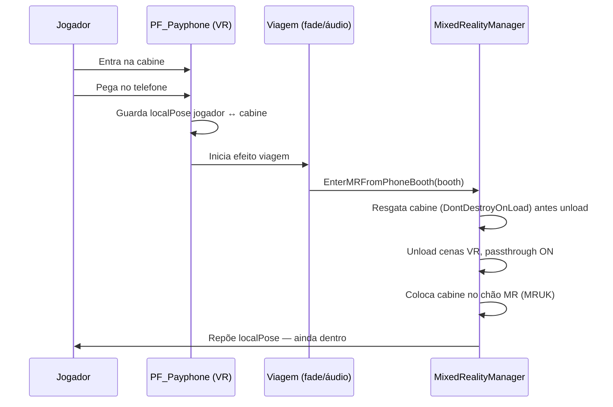
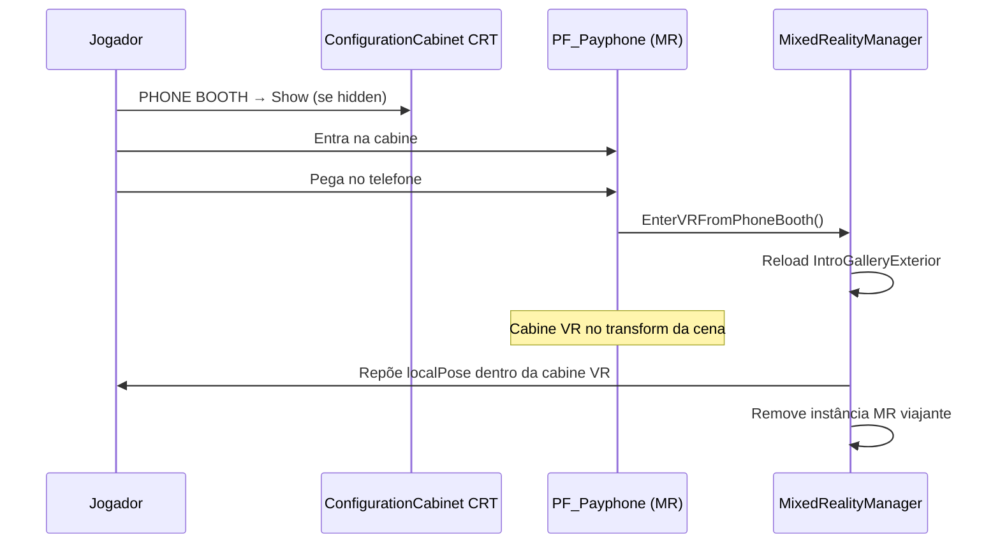

# Cabine telefónica — transição imersiva VR ↔ MR

| Campo | Valor |
|-------|-------|
| **Status** | Especificação — implementar **após** transição MR↔VR estável no Quest |
| **Relacionado** | [`MIXED_REALITY_DESIGN.md`](MIXED_REALITY_DESIGN.md) §9 |
| **Branch** | `0.5.0` |
| **Código actual** | `Assets/ramiro/` (`MixedRealityManager`, `MRConfigurationController`, …) |

---

## 1. Resumo

A **cabine telefónica** (`PF_Payphone`) na cena **`IntroGalleryExterior`** é o portal narrativo entre a galeria VR e o fliperama MR no quarto real.

- **VR → MR:** jogador entra na cabine, pega no telefone, efeito de “viagem no espaço”, chega ao MR **ainda dentro da cabine**.
- **MR → VR:** no **ConfigurationCabinetMiniMR**, opção para **mostrar/esconder** a cabine; para voltar, activa a cabine, entra nela, pega no telefone, mesma viagem inversa.
- **Posição na galeria:** ao voltar ao VR, a cabine reaparece **sempre no mesmo sítio do level design** em `IntroGalleryExterior` — nunca reposicionada por código.

O toggle genérico **A/Menu 3s** (`MRModeInput`) permanece para debug; em produção a troca imersiva deve ser **só pela cabine** (e pelo config cabinet para activar a cabine em MR).

---

## 2. Assets e cena

| Recurso | Caminho |
|---------|---------|
| Prefab | `Assets/Resources/Decoration/PhoneBooth/PF_Payphone.prefab` |
| Cena VR | `Assets/Scenes/IntroGalleryExterior.unity` (instância colocada no exterior) |
| Config MR | `Resources/ramiro/PrefabsEnvironment/ConfigurationCabinetMiniMR.prefab` |
| Efeito fade (existente) | `SM_FadeSphere` + animator (`FadeInTrigger` / `FadeOutTrigger`) — reutilizar padrão de `MRPassthroughController` / `PassthroughTriggerHandler` |

**Estado actual:** prefab com mesh, colliders, luzes e `AudioCue` / `Audio_Clunk`; **sem** script ligado ao `MixedRealityManager`.

---

## 3. Princípios de design (obrigatórios)

### 3.1 Continuidade corporal

O jogador **nunca** deve ser teleportado para “frente da cabine” ao entrar em MR ou ao voltar ao VR.

- Guardar **`localPosition` / `localRotation`** do jogador (e opcionalmente do handset) **relativos ao root da cabine**.
- Durante a viagem, cabine + jogador movem-se como **um pacote** (offset rígido).
- Ao completar a transição, aplicar o **mesmo offset local** — o jogador continua **dentro** do volume da cabine, com ou sem o telefone na mão.

### 3.2 Duas poses da cabine (VR vs MR)

| Mundo | Onde a cabine “vive” | Quem define a pose |
|-------|----------------------|--------------------|
| **VR** | `IntroGalleryExterior` | **Cena Unity** (transform fixo do prefab na cena) |
| **MR** | Quarto real (passthrough) | **MRUK** / chão detectado na chegada; pode ser escondida |

**Não** persistir posição world da cabine na galeria em `mr-layout.yaml` nem PlayerPrefs. Ao recarregar `IntroGalleryExterior`, a instância da cena **já está no sítio correcto**.

### 3.3 Cabine escondida em MR (poupar espaço)

- Menu CRT no **ConfigurationCabinetMiniMR** → opção **Show / Hide phone booth**.
- **Hide:** instância MR da cabine inactiva (sem mesh/colliders ou em “limbo” sob `MixedRealitySystem`); preferência guardada.
- **Show:** reactivar na **última pose MR** guardada (anchor MRUK ou world fallback).
- Com cabine escondida, **não há portal físico** até o jogador a activar no config cabinet.

### 3.4 Regresso ao VR

1. Config cabinet → **Show phone booth** (se hidden).
2. Jogador **entra** na cabine MR.
3. Interacção telefone → efeito viagem → `EnterVRFromPhoneBooth()`.
4. Reload `IntroGalleryExterior` (+ `IntroGallery` se aplicável).
5. Cabine VR = instância da cena no **transform original**.
6. Jogador reposto **dentro** da cabine (offset local guardado).
7. Destruir/desactivar instância “viajante” MR.

---

## 4. Fluxos

### 4.1 VR → MR (galeria exterior)



### 4.2 MR → VR (config cabinet + cabine)



---

## 5. Componentes a implementar

### 5.1 `MRPhoneBoothPortal` (MonoBehaviour no prefab ou filho)

Responsabilidades:

- Detección de jogador **dentro** do volume da cabine (trigger ou distância).
- Interacção **handset / telefone** (XRI grab, poke, ou botão quando mãos na zona).
- Guardar/restaurar **`PhoneBoothTravelState`** (offset local jogador, opcional handset).
- Disparar coroutine **`PlayTravelEffect`** antes de chamar o manager.
- Marcar instância como **viajante** (`DontDestroyOnLoad`) vs **cena VR** (não mover).

API sugerida:

```csharp
public class MRPhoneBoothPortal : MonoBehaviour
{
    public bool IsTravelerInstance { get; set; }
    public PhoneBoothTravelState CaptureTravelState();
    public void ApplyTravelState(PhoneBoothTravelState state);
    public void BeginTravelToMR();
    public void BeginTravelToVR();
}
```

### 5.2 `MRPhoneBoothSettings` (estático, PlayerPrefs)

| Chave | Tipo | Default | Uso |
|-------|------|---------|-----|
| `MR.PhoneBooth.Visible` | bool | `true` | Cabine visível em MR |
| `MR.PhoneBooth.MrPosition` | Vector3 | — | Pose MR world (fallback v2) |
| `MR.PhoneBooth.MrRotation` | Quaternion | — | Rotação MR |
| `MR.PhoneBooth.MrAnchorUuid` | string | — | Schema v3 anchor-relative (opcional, alinhar com `MRAnchorPoseResolver`) |

**Não** guardar pose VR da cabine — a cena define.

### 5.3 Extensões em `MixedRealityManager`

Novos entry points (não substituir `EnterMR`/`EnterVR` genéricos de imediato):

```csharp
public void EnterMRFromPhoneBooth(MRPhoneBoothPortal portal);
public void EnterVRFromPhoneBooth(MRPhoneBoothPortal portal);
```

Diferenças vs toggle actual:

| Aspecto | Toggle A/Menu 3s | Via cabine |
|---------|------------------|------------|
| Pose jogador | `RememberVrPlayerPose` global | **localPose relativo à cabine** |
| Cabine | Descartada no unload | **Resgatada / recriada** |
| Efeito | Haptic apenas | Fade + áudio + passthrough gradual |
| VR cabine | — | **Transform fixo da cena** após reload |

### 5.4 Menu CRT — `MRConfigurationController`

Adicionar opção ao `BuildNavMenu()`:

| Opção | Acção |
|-------|--------|
| **PHONE BOOTH** | Submenu |
| → Show / Hide | `MRPhoneBoothSettings.SetVisible(true/false)` + show/hide instância MR |
| → (estado) | Texto: `VISIBLE` / `HIDDEN` |

Persistência e padrão UI: seguir **`MRAdjustmentsSettings`** (stick direito, passos, PlayerPrefs).

### 5.5 Efeito “viagem no espaço”

Requisitos mínimos (MVP):

- Áudio: `AudioCue` / sons existentes no prefab + opcional loop durante transição.
- Visual: `SM_FadeSphere` ou overlay passthrough + fade; evitar ecrã preto seco.
- Duração configurável (~3–5s), **bloquear nova viagem** enquanto corre.
- Passthrough: subir **durante** a viagem VR→MR (não só no fim).

Fase polish: partículas, vibração OVR, AGEBasic no CRT (futuro).

---

## 6. Integração com transição actual

**Pré-requisito:** corrigir e validar no Quest:

- `EnterVRCoroutine` — reload galeria, despawn cabinets MR, passthrough off.
- `EnterMRCoroutine` — unload galeria, passthrough on, spawn layout.

A cabine **encaixa por cima**:

1. **VR → MR:** antes de `UnloadVrScenes`, `MRPhoneBoothPortal` passa a filho de `MixedRealitySystem` (ou clone com estado copiado); após MRUK, posicionar no chão real; **não** chamar `RestoreVrPlayerPose` global — usar `ApplyTravelState`.
2. **MR → VR:** `ReloadVrScenes` primeiro (como hoje); localizar `PF_Payphone` na cena carregada (`Find` por tag/nome ou `[SerializeField]` registry na cena); `ApplyTravelState`; despawn instância viajante.

### 6.1 Resolução da cabine VR após reload

```csharp
// Pseudocódigo — pose da cena é autoritativa
GameObject booth = FindScenePayphone(); // nome "PF_Payphone" em IntroGalleryExterior
// booth.transform — NÃO modificar posição/rotação
player.SetPositionAndRotation(
    booth.transform.TransformPoint(savedLocalPosition),
    booth.transform.rotation * savedLocalRotation);
```

---

## 7. Checklist de implementação

### Fase A — Fundação (depende fix MR↔VR)

- [ ] Transição MR↔VR estável no Quest (FixedScene + IntroGallery)
- [ ] `PhoneBoothTravelState` struct + serialização mínima
- [ ] `MRPhoneBoothPortal` — volume interior + interacção telefone
- [ ] `EnterMRFromPhoneBooth` / `EnterVRFromPhoneBooth` no manager

### Fase B — Viagem e continuidade

- [ ] Coroutine efeito viagem (fade + áudio)
- [ ] Resgate cabine antes de `UnloadVrScenes`
- [ ] Repor jogador com **localPose** (VR→MR e MR→VR)
- [ ] Cabine VR **sem alteração de transform** após reload de cena

### Fase C — Config cabinet

- [ ] Opção **PHONE BOOTH** no CRT
- [ ] `MRPhoneBoothSettings` Show/Hide + persistência
- [ ] Pose MR da cabine viajante guardada ao esconder/mover (só lado MR)

### Fase D — Polish e produção

- [ ] Desactivar ou restringir toggle A/Menu 3s na galeria (manter debug em dev)
- [ ] Testes: ida, volta, hide → show → volta, handset na mão vs largado
- [ ] Documentar em [`AGENTS.md`](AGENTS.md) / skill `implement-mr-phase` se necessário

---

## 8. Testes de aceitação

| # | Cenário | Resultado esperado |
|---|---------|-------------------|
| 1 | VR: entra na cabine, telefone, viagem | MR: passthrough, **dentro** da cabine, offset igual |
| 2 | MR → VR via cabine | Exterior: cabine **no sítio da cena**, jogador **dentro** |
| 3 | Config: Hide booth | Cabine MR desaparece; arcade MR continua |
| 4 | Hidden → Show → entrar → telefone | Volta à galeria; cabine exterior no **mesmo lugar** |
| 5 | Segunda sessão | Hide/Show preference mantida; pose VR cabine inalterada |

---

## 9. Fora de âmbito (MVP)

- Duas cabines simultâneas (só uma instância viajante).
- Mover cabine VR na galeria via menu.
- AGEBasic a controlar o telefone (fase futura).
- Anchor espacial Meta (`OVRSpatialAnchor`) para cabine MR — opcional fase 4; MRUK basta no MVP.

---

## 10. Referências de código

| Ficheiro | Uso |
|----------|-----|
| `Assets/ramiro/MixedRealityManager.cs` | Transições; novos entry points cabine |
| `Assets/ramiro/MRSceneTransition.cs` | Reload/unload `IntroGalleryExterior` |
| `Assets/ramiro/MRConfigurationController.cs` | Menu CRT — opção PHONE BOOTH |
| `Assets/ramiro/MRAdjustmentsSettings.cs` | Padrão PlayerPrefs para settings MR |
| `Assets/ramiro/MRAnchorPoseResolver.cs` | Pose anchor-relative (cabine MR opcional) |
| `Assets/ramiro/MRModeInput.cs` | Toggle debug 3s — restringir em produção |
| `Assets/geometrizer/scripts/PassthroughTriggerHandler.cs` | Referência fade/passthrough zona galeria |

---

*Documento criado para implementação futura — alinhado com discussão de design Maio 2026.*
